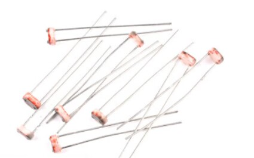
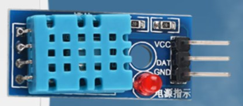
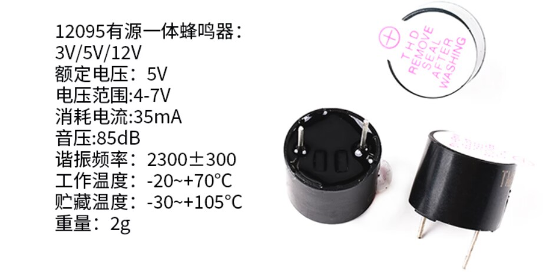
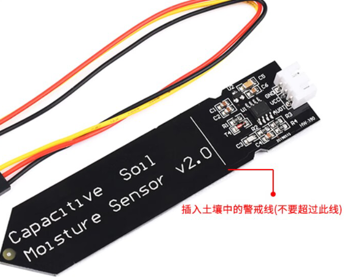
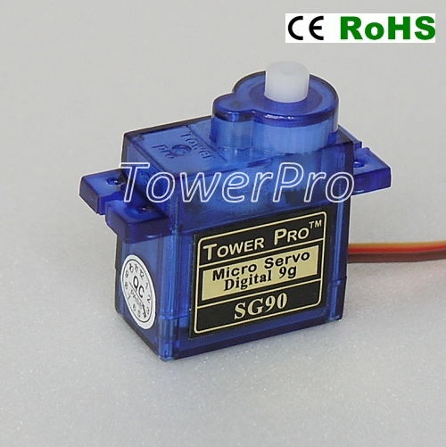
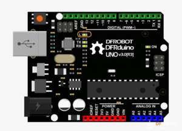
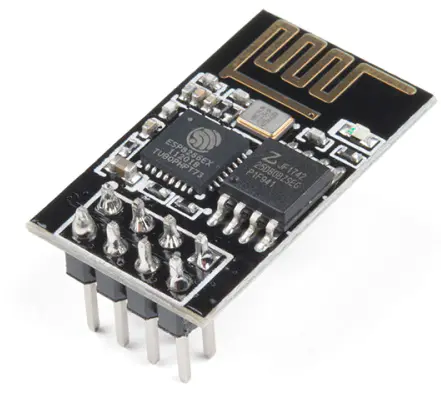
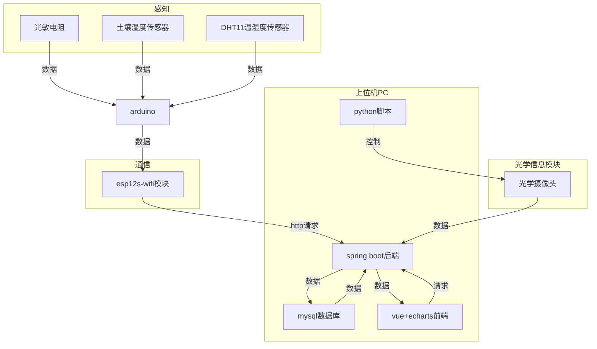
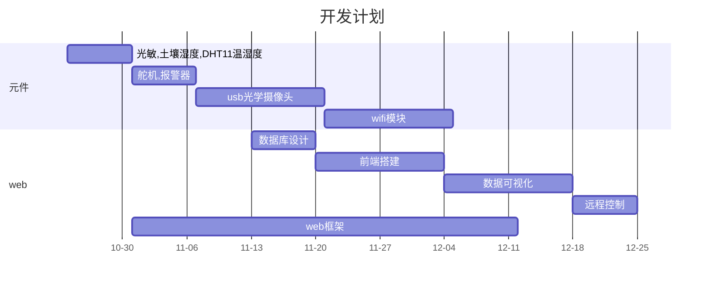

# plant_growth_environment_monitoring_system_using_arduino

## 项目名称

智能植物环境监测应用的实现

（选题来源：基于多种传感器的技术应用）

## 项目介绍

基于光敏电阻，土壤湿度传感器，温湿度传感器，报警器，舵机等元件，集合远程环境监测和提醒功能的应用。

### 硬件清单

5506光敏电阻

DHT11温湿度传感器模块

12095有源一体式蜂鸣器

电容式土壤湿度传感器

9G舵机

arduino uno开发板

esp8266 wifi模块

### 系统架构图

整个系统分为感知元件，通信元件，arduino，控制元件，上位机

## 技术路线

wifi技术，echarts组件数据可视化，vue+springboot web，sqlite数据库

## 开发计划

